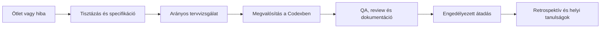
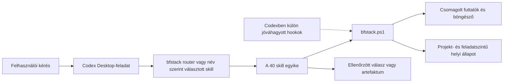
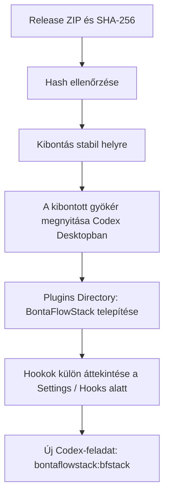

# BontaFlowStack

**40 munkafolyamat egy Codex-feladaton belül.** A BontaFlowStack skilleket, helyi projektmemóriát és csomagolt Windows-eszközöket ad a Codex Desktophoz. Egy ötlet tisztázásához, hibakereséshez, böngészős ellenőrzéshez, kódvizsgálathoz vagy dokumentált átadáshoz is választhatsz célzott skillt.


[**0.1.4 letöltése**](https://github.com/BillBalint-SM/bontaflowstack-workbook/releases/tag/v0.1.4) · [Telepítési útmutató](docs/bontaflowstack/INSTALL-WINDOWS.md) · [Mind a 40 skill](#a-40-skill)

> **Kiadási állapot:** a 0.1.4 előzetes kiadás. A ZIP csomagellenőrzése sikeres; a teljes natív Codex Desktop-elfogadás ennél a buildnél még **NOT_RUN**.

## Mire jó?

A `bfstack` belépőskill a kérésedhez illő munkafolyamatot választja ki. A célt és a már meghozott döntéseket ugyanabban a Codex-feladatban adja tovább a kiválasztott skillnek. Egyetlen skillt közvetlenül is kérhetsz.

### Főbb skillek, tipikus helyzetek

| Ha ezt szeretnéd… | Ezzel indulj |
| --- | --- |
| Egy ötletből tiszta probléma és specifikáció legyen | `office-hours` → `spec` |
| A terv termék-, design-, fejlesztői és mérnöki szempontból is átgondolt legyen | `autoplan` |
| Egy webes folyamat valódi böngészőben kapjon próbát | `qa-only` vagy, javítási felhatalmazással, `qa` |
| Egy hiba okát megtaláld és a javítást ellenőrizd | `investigate` |
| Kódot, biztonsági kockázatot vagy változást vizsgálj | `review`, `cso`, `health` |
| Az átadás előtt összeálljon a bizonyíték, dokumentáció és PR | `ship` |
| A projekt döntéseit és tanulságait később is megtaláld | `bontaflow-memory`, `context-save`, `learn` |



A router a kéréshez illő legkisebb skillt választja; a teljes ábrán nem kell végighaladni. Olvasási vagy review-kérés önmagában nem jogosít fájlmódosításra, commitra vagy publikálásra.

## Hogyan működik?

A plugin azonosítója `bontaflowstack`; a rövid router- és parancsnév `bfstack`. A skill saját, csomagrelatív PowerShell-belépési ponton át éri el a futtatókat. Az állapot a kiválasztott projekthez és feladathoz kötődik; az alapértelmezett helye `%LOCALAPPDATA%\BontaFlowStack\state`.



A böngészős skillek a csomagolt Chromiumot használják; látható bejelentkezésnél az ember lép be, majd a folyamat folytatható. A helyi memóriaskill nem végez külső szinkront. Külső GitHub-, webes vagy telepítési művelethez a megfelelő cél és felhatalmazás kell. Hiányzó böngésző, hookbizalom vagy bejelentkezés esetén a workflow konkrét akadályt jelez.

### A belépési pont működési módjai

A skilleknek egy közös, csomagon belüli indítója van: `plugins/bontaflowstack/scripts/bfstack.ps1`. A `-Mode` kapcsoló a technikai belépési útvonalat választja.

| Mód | Feladat |
| --- | --- |
| `check` | Az alapvető csomagolt runtime ellenőrzése. |
| `read` | A HOST-szerződés és egy megnevezett skill utasításainak kiolvasása, végrehajtás nélkül. |
| `run` | Csomagolt runtime-parancs futtatása szabványos bemenetről. |
| `hook` | Jóváhagyott elővégrehajtási hook kezelése. |
| `safety` | Projekt- és feladatszintű biztonsági szabály vagy állapot kiértékelése. |
| `lifecycle` | Jóváhagyott életciklus-esemény kezelése. |
| `questions` | Kérdésesemény kezelése a támogatott Codex-eszközökhöz. |

A [HOST-szerződés](plugins/bontaflowstack/HOST.md) írja le a határokat és a hibák kezelését. A hookok nem írják felül a Codex saját jogosultságait; a `careful`, `freeze`, `guard` és `unfreeze` működése a megfelelő natív hook megfigyelésétől is függ.

## A 40 skill

Minden skill a telepített csomagban `bontaflowstack:<név>` alakban hívható. A linkek a kiadott skillleírásokra mutatnak.

### Indítás és tervezés

| Skill | Mikor használd? |
| --- | --- |
| [bfstack](plugins/bontaflowstack/skills/bfstack/SKILL.md) | Kiválasztja a kéréshez illő skillt; puszta tanácskérésnél csak javasol. |
| [office-hours](plugins/bontaflowstack/skills/office-hours/SKILL.md) | Üzleti vagy termékötletet tisztáz, feltevéseket vizsgál és rövid briefet készít. |
| [spec](plugins/bontaflowstack/skills/spec/SKILL.md) | A kérést hatókörrel, viselkedéssel és elfogadási feltételekkel rendelkező specifikációvá alakítja. |
| [autoplan](plugins/bontaflowstack/skills/autoplan/SKILL.md) | Az arányos tervvizsgálatokat ugyanabban a feladatban, egymás után futtatja. |
| [plan-ceo-review](plugins/bontaflowstack/skills/plan-ceo-review/SKILL.md) | A probléma, érték és hatókör termékoldali kockázatait vizsgálja. |
| [plan-eng-review](plugins/bontaflowstack/skills/plan-eng-review/SKILL.md) | Architektúrát, helyességet, teszteket és megvalósíthatóságot vizsgál. |
| [plan-design-review](plugins/bontaflowstack/skills/plan-design-review/SKILL.md) | UI-terv hierarchiáját, állapotait, reszponzivitását és hozzáférhetőségét nézi át. |
| [plan-devex-review](plugins/bontaflowstack/skills/plan-devex-review/SKILL.md) | A tervezett API, CLI, SDK és fejlesztői belépés használhatóságát elemzi. |
| [plan-tune](plugins/bontaflowstack/skills/plan-tune/SKILL.md) | Helyi kérdezési preferenciákat és profilt tekint át vagy kifejezett kérésre módosít. |

### Design és böngésző

| Skill | Mikor használd? |
| --- | --- |
| [design-consultation](plugins/bontaflowstack/skills/design-consultation/SKILL.md) | Briefből koherens designrendszert és jóváhagyható irányt dolgoz ki. |
| [design-shotgun](plugins/bontaflowstack/skills/design-shotgun/SKILL.md) | Több különböző vizuális irányt tesz összehasonlíthatóvá. |
| [design-html](plugins/bontaflowstack/skills/design-html/SKILL.md) | Elfogadott irányból reszponzív HTML-t vagy projektbeli komponenst készít és renderelve ellenőriz. |
| [design-review](plugins/bontaflowstack/skills/design-review/SKILL.md) | Valódi UI-kimeneten keres vizuális és interakciós hibákat. |
| [browse](plugins/bontaflowstack/skills/browse/SKILL.md) | Oldalt olvas, felületet vizsgál, képernyőképet készít és engedélyezett böngészős műveletet végez. |
| [open-bfstack-browser](plugins/bontaflowstack/skills/open-bfstack-browser/SKILL.md) | Láthatóan megnyitja a csomagolt böngészőt, például kézi bejelentkezéshez. |
| [scrape](plugins/bontaflowstack/skills/scrape/SKILL.md) | Egy megadott oldalból ellenőrzött strukturált adatot vagy forráshoz kötött választ ad. |
| [skillify](plugins/bontaflowstack/skills/skillify/SKILL.md) | Sikeres scrape-próbából tesztelt, újrahasználható böngészőskillt készít a megadott hatókörben. |
| [benchmark](plugins/bontaflowstack/skills/benchmark/SKILL.md) | Valós oldalteljesítményt mér és kompatibilis mérési alapokkal vet össze. |

### Hibakeresés és minőség

| Skill | Mikor használd? |
| --- | --- |
| [investigate](plugins/bontaflowstack/skills/investigate/SKILL.md) | Hibát reprodukál, a valódi hívókon át okot keres, majd engedélyezett javítást ellenőriz. |
| [review](plugins/bontaflowstack/skills/review/SKILL.md) | Megadott változást vizsgál helyesség, hatókör és regresszió szempontjából. |
| [cso](plugins/bontaflowstack/skills/cso/SKILL.md) | Kódbázis vagy változás biztonsági kockázatait és bizalmi határait auditálja. |
| [health](plugins/bontaflowstack/skills/health/SKILL.md) | A projekt meglévő minőségellenőrzéseit futtatja és a tényleges eredményt jelenti. |
| [qa-only](plugins/bontaflowstack/skills/qa-only/SKILL.md) | Engedélyezett webalkalmazást tesztel, reprodukálható hibákat jelent kódmódosítás nélkül. |
| [qa](plugins/bontaflowstack/skills/qa/SKILL.md) | Körülhatárolt webes folyamatot tesztel, felhatalmazott hibákat javít és újrapróbál. |
| [devex-review](plugins/bontaflowstack/skills/devex-review/SKILL.md) | Valódi első sikerút és hibaút alapján vizsgálja a fejlesztői élményt. |
| [document-generate](plugins/bontaflowstack/skills/document-generate/SKILL.md) | Hiányzó projekt- vagy moduldokumentációt ír ellenőrzött kódból és példákból. |
| [document-release](plugins/bontaflowstack/skills/document-release/SKILL.md) | Meglévő dokumentációt igazít egy ellenőrzött változáshoz. |

### Átadás és üzemeltetés

| Skill | Mikor használd? |
| --- | --- |
| [setup-deploy](plugins/bontaflowstack/skills/setup-deploy/SKILL.md) | Megadott célra helyi deploy-beállításokat vizsgál vagy készít elő. |
| [ship](plugins/bontaflowstack/skills/ship/SKILL.md) | Ellenőrzést, review-t és dokumentációt köt össze az engedélyezett commit, push és PR előtt. |
| [land-and-deploy](plugins/bontaflowstack/skills/land-and-deploy/SKILL.md) | Konkrét PR készenlétét ellenőrzi, majd felhatalmazással merge-el vagy telepít és visszaellenőriz. |
| [landing-report](plugins/bontaflowstack/skills/landing-report/SKILL.md) | A kiválasztott repó átadási sorát és blokkolóit olvassa, Git-módosítás nélkül. |
| [retro](plugins/bontaflowstack/skills/retro/SKILL.md) | Megadott Git-időszak szállítási és minőségi tanulságait összegzi. |

### Helyi kontextus és memória

| Skill | Mikor használd? |
| --- | --- |
| [bontaflow-memory](plugins/bontaflowstack/skills/bontaflow-memory/SKILL.md) | Projektbeli döntéseket, tanulságokat és futáselőzményeket olvas vagy rögzít helyben. |
| [context-save](plugins/bontaflowstack/skills/context-save/SKILL.md) | Git-állapotot, döntéseket és hátralévő munkát ment folytatható pillanatképként. |
| [context-restore](plugins/bontaflowstack/skills/context-restore/SKILL.md) | A mentett helyi kontextust visszaolvassa és összefoglalja. |
| [learn](plugins/bontaflowstack/skills/learn/SKILL.md) | Helyi tanulságokat keres, vizsgál, ad hozzá, exportál vagy ritkít. |

### Munkahatárok

| Skill | Mikor használd? |
| --- | --- |
| [careful](plugins/bontaflowstack/skills/careful/SKILL.md) | A feladatban figyelmeztet a romboló parancsokra. |
| [freeze](plugins/bontaflowstack/skills/freeze/SKILL.md) | Az engedélyezett szerkesztést egy projektbeli könyvtárra korlátozza. |
| [guard](plugins/bontaflowstack/skills/guard/SKILL.md) | Együtt alkalmaz rombolóparancs-figyelmeztetést és szerkesztési határt. |
| [unfreeze](plugins/bontaflowstack/skills/unfreeze/SKILL.md) | A jelen feladat szerkesztési határát oldja fel, a careful figyelmeztetést megtartva. |

## Mi van a telepíthető csomagban?

A Release ZIP az alábbi eszközöket **a plugin mellett** tartalmazza; a felhasználói telepítéshez nem kell ezeket külön a rendszerre tenni.

| Összetevő | Szerep |
| --- | --- |
| PowerShell-indító és `bfstack` segédparancsok | A skillek, hookok és futtatók közös belépési pontjai. |
| Bun 1.4.2, Node.js 24.21.0 | A csomagolt JavaScript és TypeScript futtatása. |
| Portable Git / Git Bash 2.55.0.windows.3, jq 1.8.2 | Scriptfuttatás, Git-műveletek és JSON-feldolgozás. |
| Playwright 1.62.1 és csomagolt Chromium | Helyi böngészős ellenőrzés, képernyőkép és webes munkafolyamat. |
| `browse.exe`, `find-browse.exe`, `design.exe` | A böngészős és designfeladatok előre fordított belépési pontjai. |
| Böngészőkiegészítő és HTML-renderelő | Felületvizsgálat és designmegjelenítés, a csomag saját erőforrásaiból. |
| Helyi memória- és naplósegédek | Projektbeli döntések, tanulságok, checkpointok és futási események. |
| Codex-hookok | Safety-, kérdés- és lifecycle-megfigyelés, külön natív bizalmi döntéssel. |

**A teljes telepítéshez a Release ZIP-et használd.** A GitHub „Code → Download ZIP” archívuma csak a fejlesztői forrást tartalmazza.

## Telepítés Windows x64 rendszeren



1. A [v0.1.4 Release-ből](https://github.com/BillBalint-SM/bontaflowstack-workbook/releases/tag/v0.1.4) töltsd le a `bontaflowstack-0.1.4-deb14b0fadc2424baeb0ad06511c73c6.zip` fájlt és a mellette lévő `.sha256` fájlt.
2. Ellenőrizd a ZIP SHA-256 értékét. A várt érték: `53c7ae4021990a3712e89465584c8f8244747b23e343530f3bbec8ffb3f20559`. A letöltési könyvtárban futtatva:

   ```powershell
   (Get-FileHash -LiteralPath '.\bontaflowstack-0.1.4-deb14b0fadc2424baeb0ad06511c73c6.zip' -Algorithm SHA256).Hash
   ```

3. Bontsd ki a ZIP-et stabil, írható könyvtárba. A `.agents/plugins/marketplace.json` és a `plugins/bontaflowstack/` könyvtár maradjon a kibontott gyökér alatt.
4. A kibontott gyökeret nyisd meg Codex Desktop-projektként, indítsd újra a Desktopot, majd a **Plugins Directory** nézetben telepítsd a **BontaFlowStack** plugint.
5. A **Settings → Hooks** alatt nézd át a négy BontaFlowStack-hookot. A bizalom külön, natív döntés; a plugin telepítése önmagában nem jelenti a hookok jóváhagyását.
6. Új Codex-feladatban ellenőrizd, hogy megjelenik a `$bontaflowstack:bfstack` belépőskill.

A részletes [Windows telepítési útmutató](docs/bontaflowstack/INSTALL-WINDOWS.md) a hookok határait és az eltávolítást is leírja. Eltávolításhoz a Codex natív pluginfelületét használd; a külön helyi állapot felhasználói adat, nem törlődik automatikusan.

## Első lépések

A routert természetes nyelvű kéréssel indíthatod. Példák:

```text
$bontaflowstack:bfstack
Tisztázd ezt az ötletet, majd készíts hozzá ellenőrizhető specifikációt.
```

```text
$bontaflowstack:bfstack
Nézd át ezt a változást helyesség és regresszió szempontjából. Csak jelents; ne módosíts fájlt.
```

```text
$bontaflowstack:bontaflow-memory
Olvasd ki a projekt legutóbbi tanulságait. Ha nincs bejegyzés, jelentsd üresként.
```

A név szerint megadott skill közvetlenül is használható. A munkahatárt és az engedélyezett külső műveleteket a kérésben érdemes pontosítani.

## Forrás, fejlesztés és licencek

A `main` tartalmazza a 40 skillt és a futtató forrását. A függőségek a [`runtime/bun.lock`](runtime/bun.lock) fájlban rögzítettek; a [`scripts/build-renderers.ps1`](scripts/build-renderers.ps1) Windows alatt újraépíti a renderer-kimeneteket.

A projekt forrásait és átvételi nyilvántartását a [forrásjegyzék](docs/references.md) írja le; a [licencek és eredetjelölések](plugins/bontaflowstack/licenses) a plugin részei. A csomag működési nevei `bontaflowstack` és `bfstack`; a nyilvántartás régi `source` fájlnevei kizárólag a származást jelölik.
