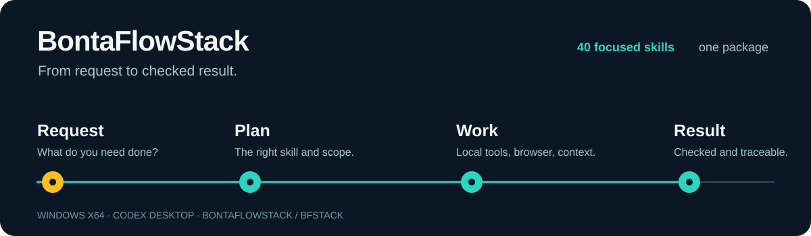
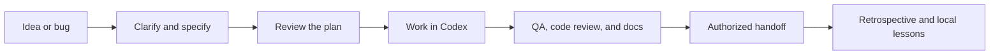
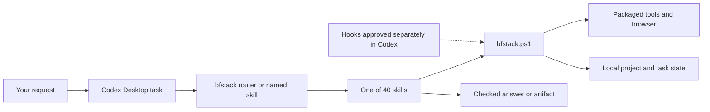
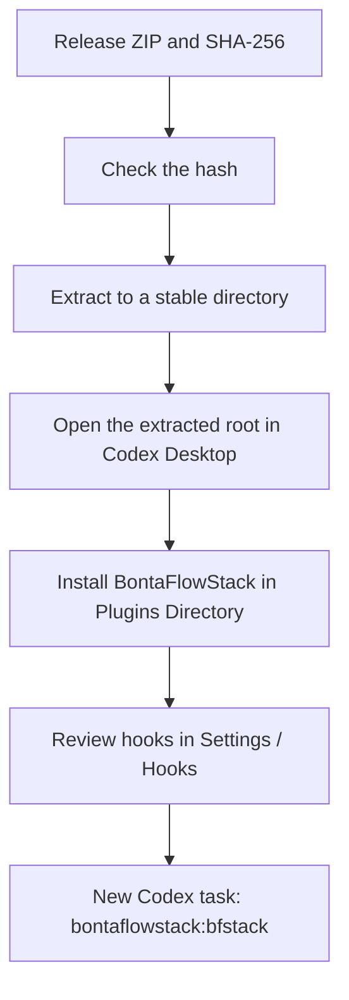

# BontaFlowStack

**Pick the workflow that fits the job.** BontaFlowStack brings 40 Codex skills, local project memory, and packaged Windows tools into Codex Desktop. Use it to shape an idea into a spec, investigate a bug, check a web flow in a browser, review code, or prepare a documented handoff.



[Download v0.1.4](https://github.com/BillBalint-SM/bontaflowstack-workbook/releases/tag/v0.1.4) · [Windows installation guide](docs/bontaflowstack/INSTALL-WINDOWS.md) · [Browse all 40 skills](#all-40-skills)

> **Release status:** The owner accepted v0.1.4 on 2026-09-26 based on the package checks, a native Desktop smoke test, and four local agent cases. The full native Desktop E2E inventory was not run. [Evidence and remaining goals](docs/bontaflowstack/INSTALL-WINDOWS.md#verification-and-release-decision).

## Find the right workflow

Start with `$bontaflowstack:bfstack` when you know what you want done but do not know which skill to use. The router selects a workflow for the request and carries the goal and decisions into that workflow in the same Codex task. You can also call any skill by name.

| Your task | Start with |
| --- | --- |
| Turn an idea into a clear problem and spec | `office-hours`, then `spec` |
| Check a plan from product, design, developer, and engineering angles | `autoplan` |
| Test a web flow in a real browser | `qa-only`, or `qa` if you have authorized fixes |
| Trace a bug to its cause and check the fix | `investigate` |
| Review a change, security risks, or project checks | `review`, `cso`, or `health` |
| Gather the checks and documentation needed for a PR | `ship` |
| Find decisions and lessons from earlier work | `bontaflow-memory`, `context-save`, or `learn` |



The diagram shows the available path, not a required sequence. The router chooses the smallest workflow that fits the request. A request to read or review does not authorize file edits, commits, or publication.

## How it works

The plugin ID is `bontaflowstack`. Its short router and command name is `bfstack`. Skills reach the packaged tools through a PowerShell launcher inside the plugin. State belongs to the selected project and task; its default location is `%LOCALAPPDATA%\BontaFlowStack\state`.



Browser skills use the packaged Chromium. When a visible login is needed, you sign in and the workflow can continue. Local memory does not sync to an external service. GitHub, web, and installation actions need an authorized target. If a browser, trusted hook, or login is missing, the workflow reports the blocker.

### Launcher modes

All skills use `plugins/bontaflowstack/scripts/bfstack.ps1`. Its `-Mode` argument selects the entry point.

| Mode | Purpose |
| --- | --- |
| `check` | Check that the packaged runtime is available. |
| `read` | Read the host contract and a named skill's instructions without running the skill. |
| `run` | Run a packaged runtime command supplied on standard input. |
| `hook` | Handle an approved pre-execution hook event. |
| `safety` | Evaluate a project or task safety rule or state. |
| `lifecycle` | Handle an approved lifecycle event. |
| `questions` | Handle a question event for supported Codex tools. |

The [host contract](plugins/bontaflowstack/HOST.md) describes the boundaries and failure behavior. Hooks do not change Codex permissions. `careful`, `freeze`, `guard`, and `unfreeze` also depend on the appropriate native hook being observed.

## All 40 skills

Installed skills use names in the form `bontaflowstack:<name>`. Each link opens the skill's instructions in this repository.

### Start and plan

| Skill | What it does |
| --- | --- |
| [bfstack](plugins/bontaflowstack/skills/bfstack/SKILL.md) | Chooses a skill for the request. If you only ask for advice, it recommends one. |
| [office-hours](plugins/bontaflowstack/skills/office-hours/SKILL.md) | Clarifies a business or product idea, tests assumptions, and writes a short brief. |
| [spec](plugins/bontaflowstack/skills/spec/SKILL.md) | Turns a request into a spec with scope, behavior, and acceptance criteria. |
| [autoplan](plugins/bontaflowstack/skills/autoplan/SKILL.md) | Runs the relevant plan reviews in sequence within the same task. |
| [plan-ceo-review](plugins/bontaflowstack/skills/plan-ceo-review/SKILL.md) | Checks the product problem, value, and scope. |
| [plan-eng-review](plugins/bontaflowstack/skills/plan-eng-review/SKILL.md) | Reviews architecture, correctness, tests, and feasibility. |
| [plan-design-review](plugins/bontaflowstack/skills/plan-design-review/SKILL.md) | Reviews UI hierarchy, states, responsive behavior, and accessibility. |
| [plan-devex-review](plugins/bontaflowstack/skills/plan-devex-review/SKILL.md) | Checks the planned API, CLI, SDK, and developer onboarding. |
| [plan-tune](plugins/bontaflowstack/skills/plan-tune/SKILL.md) | Reads local question preferences and profile settings, or changes them when asked. |

### Design and browser

| Skill | What it does |
| --- | --- |
| [design-consultation](plugins/bontaflowstack/skills/design-consultation/SKILL.md) | Develops a design system and a direction you can approve from a brief. |
| [design-shotgun](plugins/bontaflowstack/skills/design-shotgun/SKILL.md) | Makes distinct visual directions easy to compare. |
| [design-html](plugins/bontaflowstack/skills/design-html/SKILL.md) | Builds responsive HTML or a project component from an approved direction and checks the rendered result. |
| [design-review](plugins/bontaflowstack/skills/design-review/SKILL.md) | Looks for visual and interaction problems in rendered UI. |
| [browse](plugins/bontaflowstack/skills/browse/SKILL.md) | Reads pages, inspects interfaces, captures screenshots, and performs authorized browser actions. |
| [open-bfstack-browser](plugins/bontaflowstack/skills/open-bfstack-browser/SKILL.md) | Opens the packaged browser visibly, for example when you need to sign in. |
| [scrape](plugins/bontaflowstack/skills/scrape/SKILL.md) | Extracts structured data or a source-backed answer from one requested page. |
| [skillify](plugins/bontaflowstack/skills/skillify/SKILL.md) | Turns a successful scrape into a tested, reusable browser skill within the requested scope. |
| [benchmark](plugins/bontaflowstack/skills/benchmark/SKILL.md) | Measures real page performance and compares compatible runs. |

### Investigate and check

| Skill | What it does |
| --- | --- |
| [investigate](plugins/bontaflowstack/skills/investigate/SKILL.md) | Reproduces a bug, traces its cause through real callers, and checks an authorized fix. |
| [review](plugins/bontaflowstack/skills/review/SKILL.md) | Reviews a specified change for correctness, scope, and regressions. |
| [cso](plugins/bontaflowstack/skills/cso/SKILL.md) | Audits security risks and trust boundaries in a codebase or change. |
| [health](plugins/bontaflowstack/skills/health/SKILL.md) | Runs the project's existing checks and reports what they actually found. |
| [qa-only](plugins/bontaflowstack/skills/qa-only/SKILL.md) | Tests an authorized web app and reports reproducible bugs without changing code. |
| [qa](plugins/bontaflowstack/skills/qa/SKILL.md) | Tests a scoped web flow, fixes authorized defects, and checks again. |
| [devex-review](plugins/bontaflowstack/skills/devex-review/SKILL.md) | Tries the developer's first successful path and failure path. |
| [document-generate](plugins/bontaflowstack/skills/document-generate/SKILL.md) | Writes missing project or module docs from checked code and examples. |
| [document-release](plugins/bontaflowstack/skills/document-release/SKILL.md) | Brings existing docs up to date with a checked change. |

### Ship and operate

| Skill | What it does |
| --- | --- |
| [setup-deploy](plugins/bontaflowstack/skills/setup-deploy/SKILL.md) | Inspects or prepares local deployment settings for a named target. |
| [ship](plugins/bontaflowstack/skills/ship/SKILL.md) | Pulls together checks, review, and docs before an authorized commit, push, or PR. |
| [land-and-deploy](plugins/bontaflowstack/skills/land-and-deploy/SKILL.md) | Checks a specific PR, then merges or deploys with authorization and verifies the result. |
| [landing-report](plugins/bontaflowstack/skills/landing-report/SKILL.md) | Reads a repository's delivery queue and blockers without changing Git state. |
| [retro](plugins/bontaflowstack/skills/retro/SKILL.md) | Summarizes delivery and quality lessons from a specified Git period. |

### Local context and memory

| Skill | What it does |
| --- | --- |
| [bontaflow-memory](plugins/bontaflowstack/skills/bontaflow-memory/SKILL.md) | Reads or records project decisions, lessons, and run history locally. |
| [context-save](plugins/bontaflowstack/skills/context-save/SKILL.md) | Saves Git state, decisions, and remaining work as a snapshot for later. |
| [context-restore](plugins/bontaflowstack/skills/context-restore/SKILL.md) | Reads and summarizes a saved local snapshot. |
| [learn](plugins/bontaflowstack/skills/learn/SKILL.md) | Searches, reviews, adds, exports, or prunes local lessons. |

### Work boundaries

| Skill | What it does |
| --- | --- |
| [careful](plugins/bontaflowstack/skills/careful/SKILL.md) | Warns about destructive commands during the task. |
| [freeze](plugins/bontaflowstack/skills/freeze/SKILL.md) | Limits allowed edits to one project directory. |
| [guard](plugins/bontaflowstack/skills/guard/SKILL.md) | Combines destructive-command warnings with an edit boundary. |
| [unfreeze](plugins/bontaflowstack/skills/unfreeze/SKILL.md) | Clears the current task's edit boundary while keeping `careful` warnings. |

## What comes in the ZIP

The Release ZIP includes these tools alongside the plugin. You do not need to install them separately for the packaged workflows.

| Component | Used for |
| --- | --- |
| PowerShell launcher and `bfstack` helper commands | Shared entry points for skills, hooks, and packaged tools. |
| Bun 1.4.2 and Node.js 24.21.0 | Running packaged JavaScript and TypeScript. |
| Portable Git / Git Bash 2.55.0.windows.3 and jq 1.8.2 | Shell scripts, Git operations, and JSON processing. |
| Playwright 1.62.1 and packaged Chromium | Browser checks, screenshots, and web workflows. |
| `browse.exe`, `find-browse.exe`, `design.exe` | Prebuilt entry points for browser and design tasks. |
| Browser extension and HTML renderer | Inspecting interfaces and rendering designs from packaged resources. |
| Local memory and log helpers | Project decisions, lessons, checkpoints, and run events. |
| Codex hooks | Safety, question, and lifecycle events, subject to separate approval in Codex. |

**Install from the Release ZIP.** GitHub's "Code → Download ZIP" contains the development source without the packaged binaries and dependencies.

## Install on Windows x64



1. Download `bontaflowstack-0.1.4-deb14b0fadc2424baeb0ad06511c73c6.zip` and its `.sha256` file from the [v0.1.4 release](https://github.com/BillBalint-SM/bontaflowstack-workbook/releases/tag/v0.1.4).
2. Check the ZIP's SHA-256 hash. The expected value is `53c7ae4021990a3712e89465584c8f8244747b23e343530f3bbec8ffb3f20559`. Run this in the download directory:

   ```powershell
   (Get-FileHash -LiteralPath '.\bontaflowstack-0.1.4-deb14b0fadc2424baeb0ad06511c73c6.zip' -Algorithm SHA256).Hash
   ```

3. Extract the ZIP to a stable, writable directory. Keep `.agents/plugins/marketplace.json` and `plugins/bontaflowstack/` under the extracted root.
4. Open that root as a Codex Desktop project, restart Desktop, and install **BontaFlowStack** from **Plugins Directory**.
5. Review the four BontaFlowStack hooks under **Settings → Hooks**. Installing the plugin does not approve its hooks.
6. Start a new Codex task and check that `$bontaflowstack:bfstack` is available.

The [Windows installation guide](docs/bontaflowstack/INSTALL-WINDOWS.md) covers hook boundaries and removal. Use Codex's plugin interface to uninstall. Local state is user data and is not removed automatically.

## First steps

You can give the router an ordinary request:

```text
$bontaflowstack:bfstack
Clarify this idea, then write a spec with testable acceptance criteria.
```

```text
$bontaflowstack:bfstack
Review this change for correctness and regressions. Report findings only; do not edit files.
```

Or call a skill directly:

```text
$bontaflowstack:bontaflow-memory
Read the project's latest lessons. If there are none, report an empty result.
```

State the work boundary and any authorized external actions in your request.

## Source and licenses

`main` contains the 40 skills and runner source. Dependencies are pinned in [`runtime/bun.lock`](runtime/bun.lock), and [`scripts/build-renderers.ps1`](scripts/build-renderers.ps1) rebuilds the renderer outputs on Windows.

[Source references](docs/references.md) record the project's origins and attribution. The plugin includes its [licenses and notices](plugins/bontaflowstack/licenses). Its operational names are `bontaflowstack` and `bfstack`; old filenames under `source` in the provenance records identify their original sources.
